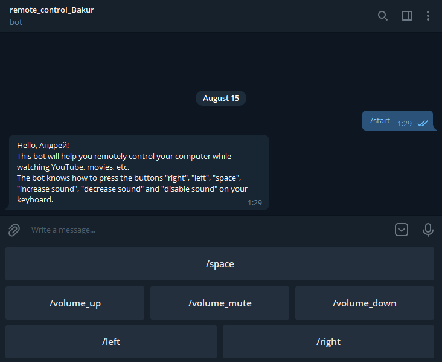

## **Description**

Computer control panel for watching YouTube, movies, etc. using a telegram bot. This bot will help you remotely control your computer while watching YouTube, movies, etc. The bot knows how to press the buttons "right", "left", "space", "increase sound", "decrease sound" and "disable sound" on your keyboard.

## **Install**
+ Install dependencies from file `requirements.txt`:
  
  `pip install -r requirements.txt`
  

+ Insert your unique bot token (get it from [Bot father](https://t.me/botfather)) into `TOKEN` (`congig.py`) variable: 

  `TOKEN = "your_token"`

+ Run `server.py`:

    `python3 server.py` or `click on file "server.py"`

+ Find your bot in telegram and run it using command `/start`
  

+ Enjoy 😋🤖🙃

## **Example**

